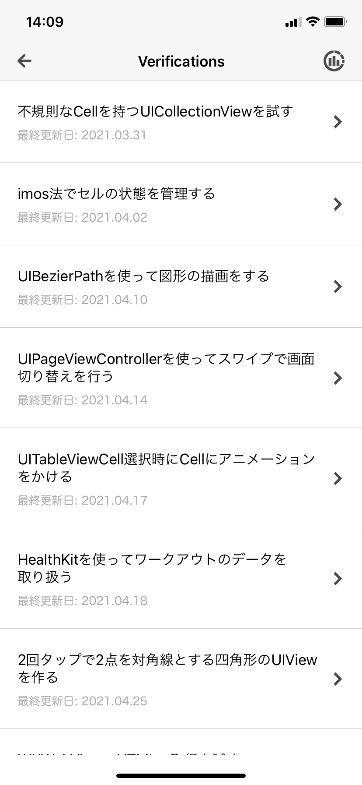
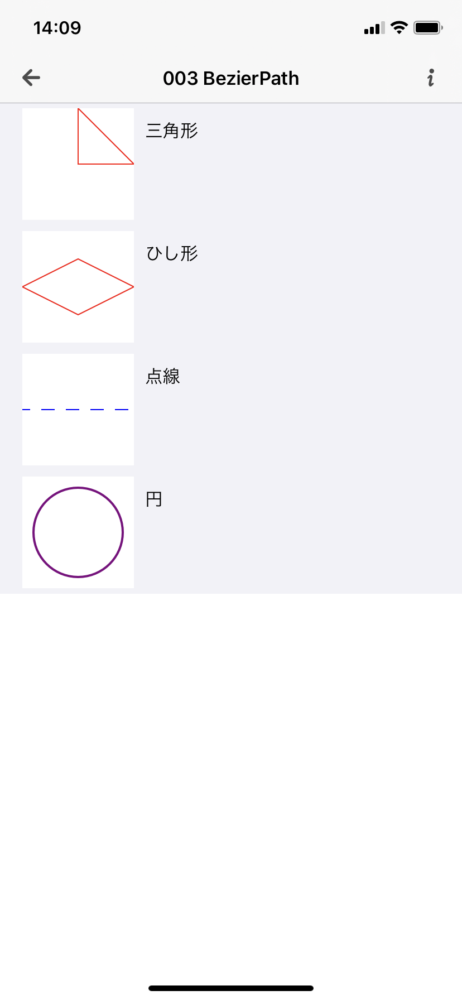
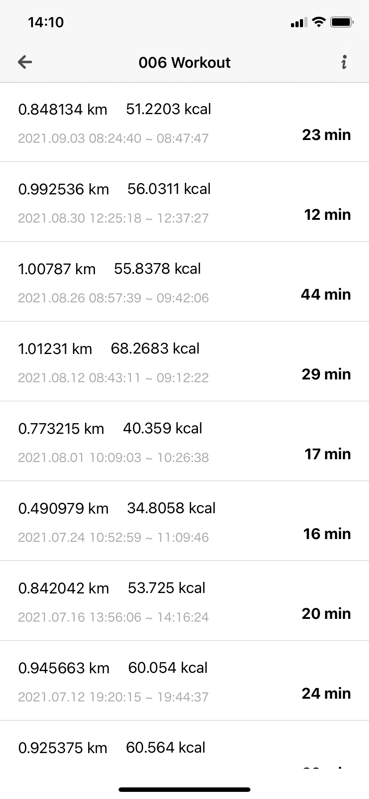
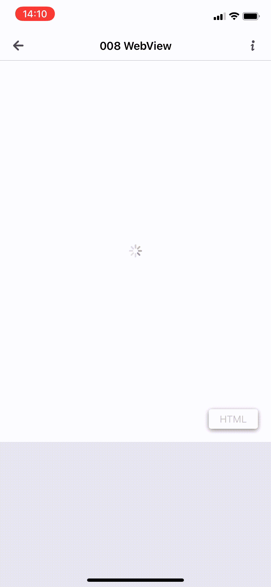
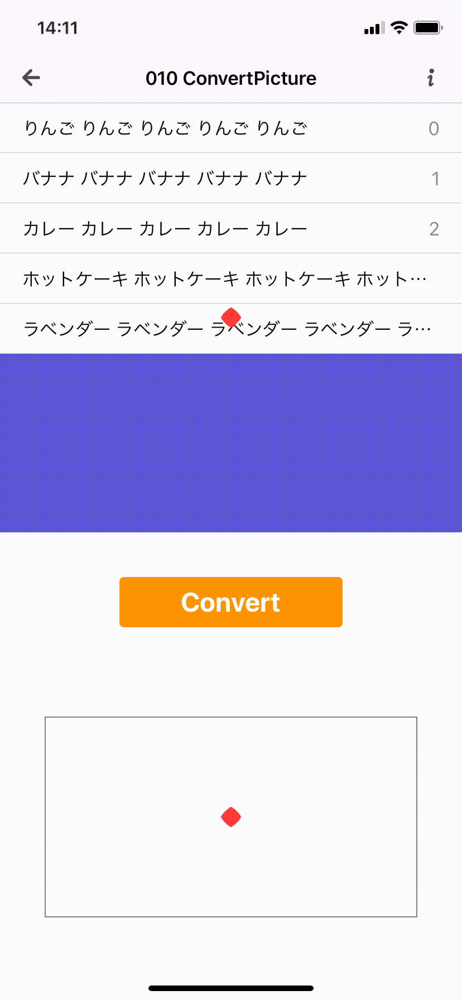
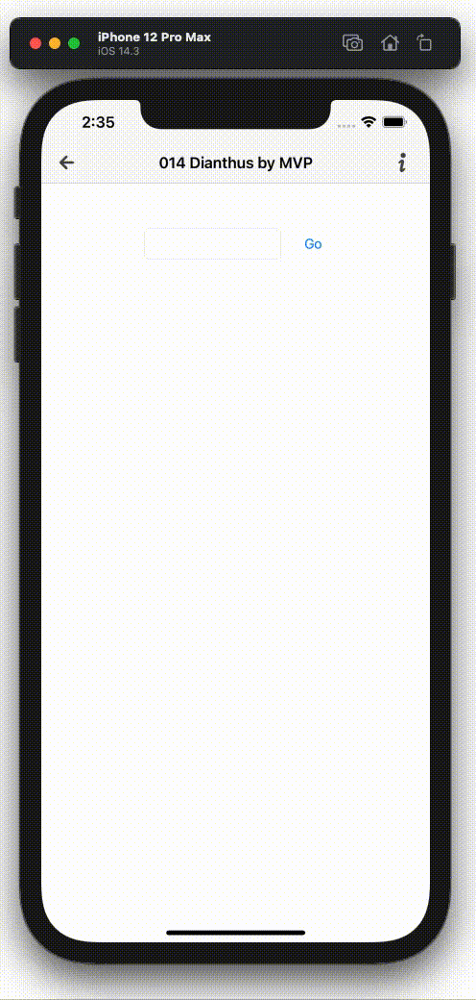
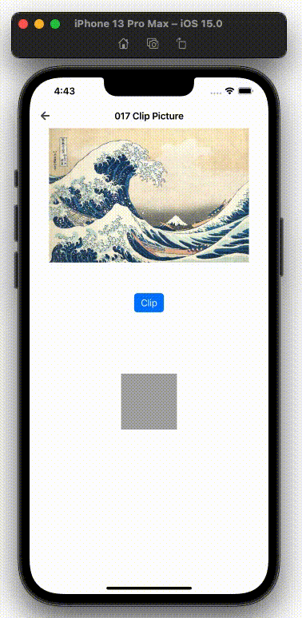

# 画面紹介ページ
  
| 画面名 |  スクリーンショット / gif |  画面内容  |
| ----  | ----------------------------- | ---- |
| 一覧   |  | 業務や趣味で学んだことを1つのセルとし、そのセルの一覧画面 |
| 003 BezierPath |  | [UIBezierPath](https://developer.apple.com/documentation/uikit/uibezierpath) を使った図形の描画を行う画面。 |
| 006 Workout |  | [HKWorkout](https://developer.apple.com/documentation/healthkit/hkworkout) を使って、Apple Watch経由で取得したランニングとウォーキングのデータをシンプルに表示する画面。HKWorkout利用の練習として実装 |
| 008 WebView |  | [WKWebView](https://developer.apple.com/documentation/webkit/wkwebview) を使って、WebページのHTML情報を抽出する画面 |
| 009 WorkoutCycling |  | [HKWorkout](https://developer.apple.com/documentation/healthkit/hkworkout) を使って、Apple Watch経由で取得したサイクリングのデータをシンプルに表示する画面。Apple公式のアプリには合計距離を簡単に表示する術がなかったので自作した |
| 010 ConvertPicture |  | UIView (gif上ではUITableView)を画像としてくり抜き、くり抜いた画像を回転させる画面|
| 014 Dianthus by MVP |  | [自作の単語を送ったら同じ母音を持つ単語のリストが返るAPI](https://github.com/tokizuoh/dianthus-server)を利用する画面 |
| 017 Clip Picture |  | 画像をランダムに切り抜く画面 | 